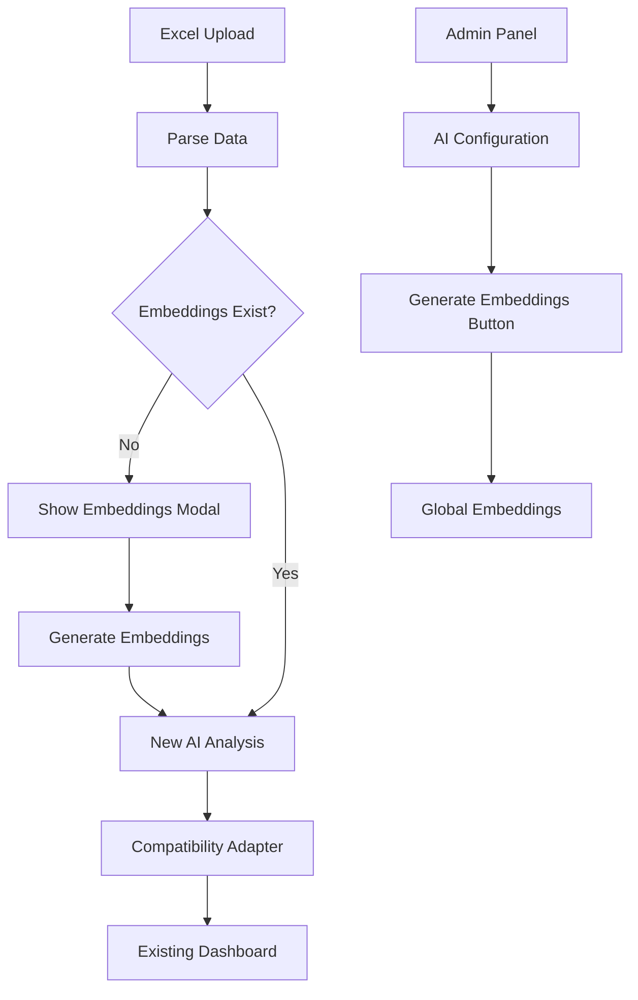

# Design Document

## Overview

Este design implementa a migração para a nova estrutura de IA com múltiplas classificações, priorizando **compatibilidade total** com componentes existentes através de adaptações na camada de API. O sistema manterá todas as funcionalidades atuais enquanto adiciona capacidades avançadas de forma transparente.

## Architecture

### Estratégia de Compatibilidade

```
┌─────────────────┐    ┌──────────────────┐    ┌─────────────────┐
│   Nova API IA   │    │  Camada de       │    │  Componentes    │
│  (Múltiplas     │───▶│  Compatibilidade │───▶│  Existentes     │
│  Issues)        │    │  (Adaptador)     │    │  (Inalterados)  │
└─────────────────┘    └──────────────────┘    └─────────────────┘
```

### Fluxo de Dados



## Components and Interfaces

### 1. Compatibility Adapter (Nova Camada)

**Localização:** `lib/ai-compatibility-adapter.ts`

```typescript
interface LegacyFeedback {
  // Formato atual esperado pelos componentes
  keyword: string;
  sector: string; 
  problem: string;
  // Novos campos opcionais
  has_suggestion?: boolean;
  suggestion_summary?: string;
  confidence?: number;
  allProblems?: Array<{
    keyword: string;
    sector: string;
    problem: string;
    problem_detail: string;
  }>;
}

interface NewAIResponse {
  // Nova estrutura da API
  sentiment: number;
  issues: Array<{
    department_id: string;
    keyword_id: string;
    problem_id: string;
    department_label: string;
    keyword_label: string;
    problem_label: string;
    detail: string;
    confidence: number;
  }>;
  has_suggestion: boolean;
  suggestion_summary: string;
  confidence: number;
}

// Função principal de adaptação
function adaptNewAIToLegacyFormat(newResponse: NewAIResponse): LegacyFeedback
```

### 2. Embeddings Management Interface

**Localização:** `app/admin/ai-configuration/page.tsx`

```typescript
interface EmbeddingsStatus {
  exists: boolean;
  generated_at?: Date;
  keywords_count: number;
  problems_count: number;
  version: number;
}

interface AIConfigurationProps {
  status: EmbeddingsStatus;
  onGenerateEmbeddings: () => Promise<void>;
  isGenerating: boolean;
  progress?: number;
}
```

### 3. Enhanced Import Process

**Modificação mínima em:** `app/import/ImportPageContent.tsx`

```typescript
// Apenas adicionar verificação de embeddings
const checkEmbeddingsBeforeImport = async () => {
  const response = await fetch('/api/embeddings-status');
  const status = await response.json();
  
  if (!status.exists) {
    setShowEmbeddingsModal(true);
    return false;
  }
  return true;
};

// Modal de embeddings (novo componente)
const EmbeddingsRequiredModal = ({ onGenerate, onContinueWithoutAI }) => {
  // Interface explicativa para gerar embeddings
};
```

### 4. API Enhancements

**Modificações em:** `app/api/analyze-feedback/route.ts`

```typescript
// Adicionar camada de compatibilidade na resposta
export async function POST(request: NextRequest) {
  // ... lógica existente da nova IA ...
  
  const newAIResult = await processWithNewAI(text);
  
  // NOVA: Camada de compatibilidade
  const compatibleResult = adaptNewAIToLegacyFormat(newAIResult);
  
  return NextResponse.json(compatibleResult);
}
```

## Data Models

### Estrutura de Dados Consolidada

```typescript
interface EnhancedFeedback extends LegacyFeedback {
  // Campos existentes (mantidos)
  id: string;
  date: string;
  comment: string;
  rating: number;
  sentiment: string;
  keyword: string;      // Consolidado: "A&B - Café;Recepção - Serviço"
  sector: string;       // Consolidado: "A&B;Recepção"
  problem: string;      // Consolidado: "Demora no Atendimento;Falta de Limpeza"
  
  // Novos campos (opcionais para compatibilidade)
  has_suggestion?: boolean;
  suggestion_type?: string;
  suggestion_summary?: string;
  confidence?: number;
  needs_review?: boolean;
  
  // Estrutura detalhada (para futuras melhorias)
  allProblems?: Array<{
    keyword: string;
    sector: string;
    problem: string;
    problem_detail: string;
    confidence: number;
  }>;
  
  // Metadados da nova IA
  taxonomy_version?: number;
  processing_time_ms?: number;
  matched_by?: 'embedding' | 'proposed';
}
```

### Embeddings Configuration

```typescript
interface EmbeddingsConfig {
  status: 'not_generated' | 'generating' | 'ready' | 'error';
  generated_at?: Date;
  version: number;
  keywords_count: number;
  problems_count: number;
  departments_count: number;
  last_error?: string;
  generation_progress?: number;
}
```

## Error Handling

### Fallback Strategy

```typescript
const processWithFallback = async (text: string) => {
  try {
    // 1. Tentar nova IA com embeddings
    return await processWithNewAI(text);
  } catch (embeddingError) {
    try {
      // 2. Fallback para análise textual
      return await processWithTextualAnalysis(text);
    } catch (textualError) {
      // 3. Fallback final - dados básicos
      return createBasicFeedback(text);
    }
  }
};
```

### Error Recovery

```typescript
interface ErrorRecovery {
  embeddings_missing: () => showEmbeddingsModal();
  api_timeout: () => useTextualFallback();
  invalid_response: () => useBasicClassification();
  rate_limit: () => queueForRetry();
}
```

## Testing Strategy

### Compatibility Testing

1. **Dados Antigos**: Verificar que feedbacks existentes continuam funcionando
2. **Dados Novos**: Validar que nova estrutura é convertida corretamente
3. **Dados Mistos**: Testar dashboards com dados antigos e novos
4. **Fallbacks**: Simular falhas e verificar recuperação

### Integration Testing

```typescript
describe('AI Compatibility Adapter', () => {
  test('converts multiple issues to consolidated format', () => {
    const newAIResponse = {
      issues: [
        { keyword_label: 'A&B - Café', problem_label: 'Demora' },
        { keyword_label: 'Recepção - Serviço', problem_label: 'Atendimento' }
      ]
    };
    
    const result = adaptNewAIToLegacyFormat(newAIResponse);
    
    expect(result.keyword).toBe('A&B - Café;Recepção - Serviço');
    expect(result.problem).toBe('Demora;Atendimento');
  });
});
```

### Performance Testing

1. **Import Performance**: Verificar que nova IA não degrada performance
2. **Dashboard Loading**: Testar carregamento com dados consolidados
3. **Memory Usage**: Monitorar uso de memória com estruturas expandidas
4. **Embeddings Generation**: Testar geração em diferentes volumes

## Implementation Phases

### Phase 1: Core Compatibility Layer
- Criar `ai-compatibility-adapter.ts`
- Modificar `/api/analyze-feedback` para usar adaptador
- Testes básicos de compatibilidade

### Phase 2: Embeddings Management
- Criar interface administrativa para embeddings
- Implementar detecção automática na importação
- Modal explicativo para usuários

### Phase 3: Enhanced Features
- Adicionar campos opcionais aos dashboards
- Implementar visualizações de sugestões
- Melhorar indicadores de confidence

### Phase 4: Optimization
- Otimizar performance da camada de compatibilidade
- Implementar cache para conversões
- Monitoramento e métricas

## Security Considerations

### API Key Management
- Embeddings generation requer API key administrativa
- Validação de permissões para geração
- Rate limiting para operações custosas

### Data Privacy
- Embeddings não contêm dados sensíveis
- Logs de geração com informações mínimas
- Cleanup automático de dados temporários

## Monitoring and Metrics

### Key Metrics
- Taxa de sucesso da nova IA vs fallback
- Tempo de processamento comparativo
- Qualidade das classificações (confidence scores)
- Uso de embeddings vs análise textual

### Alerting
- Embeddings não disponíveis
- Alta taxa de fallback
- Erros de compatibilidade
- Performance degradada